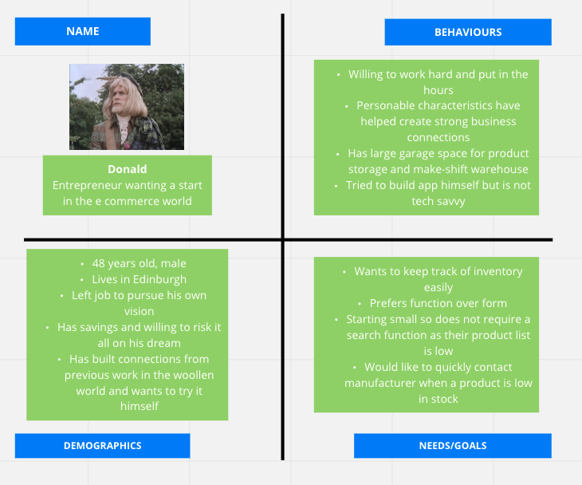
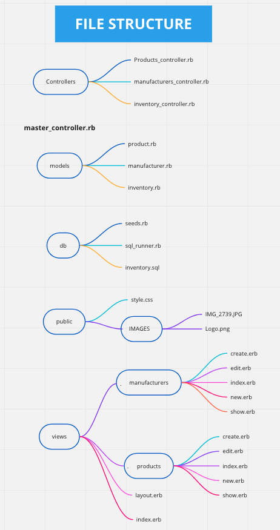
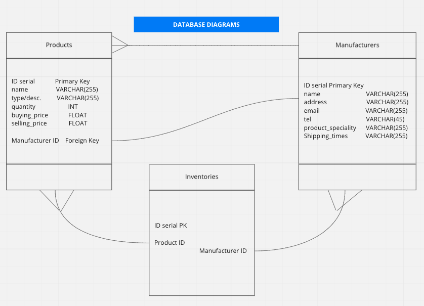
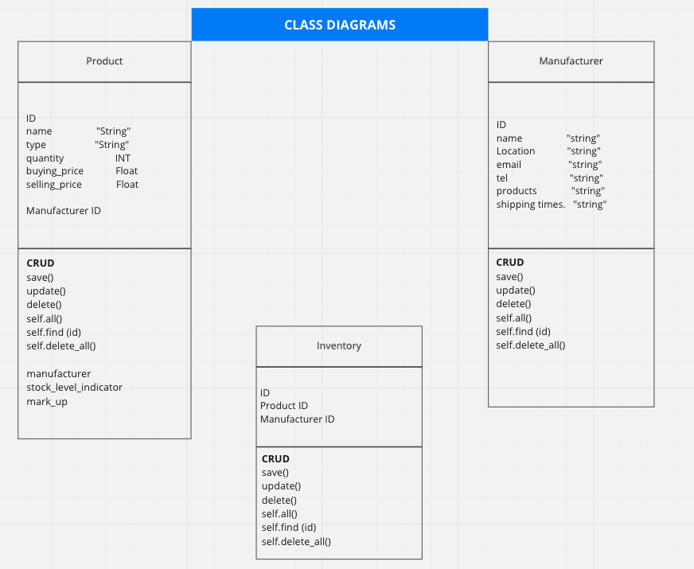
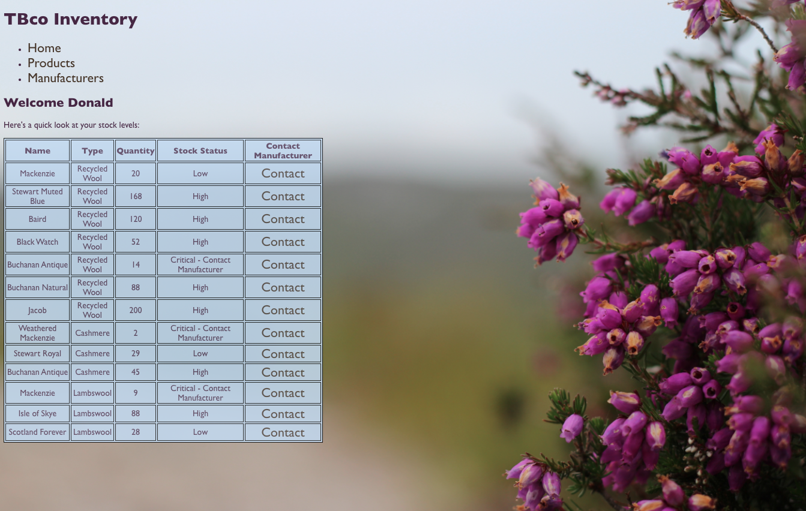
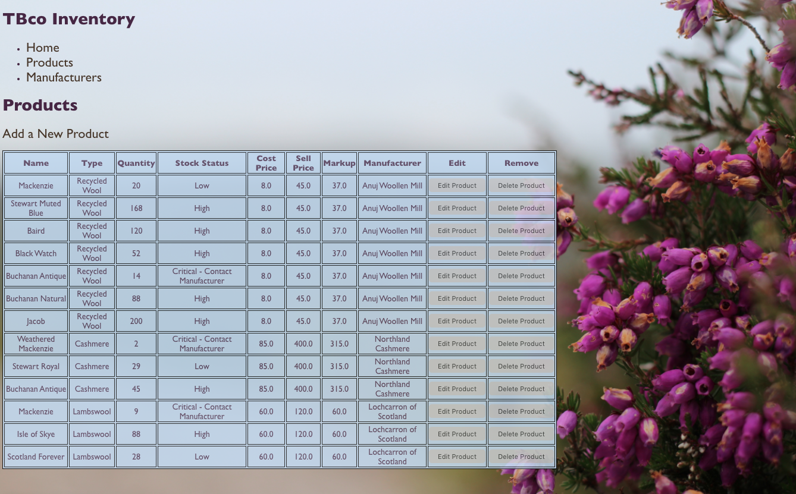
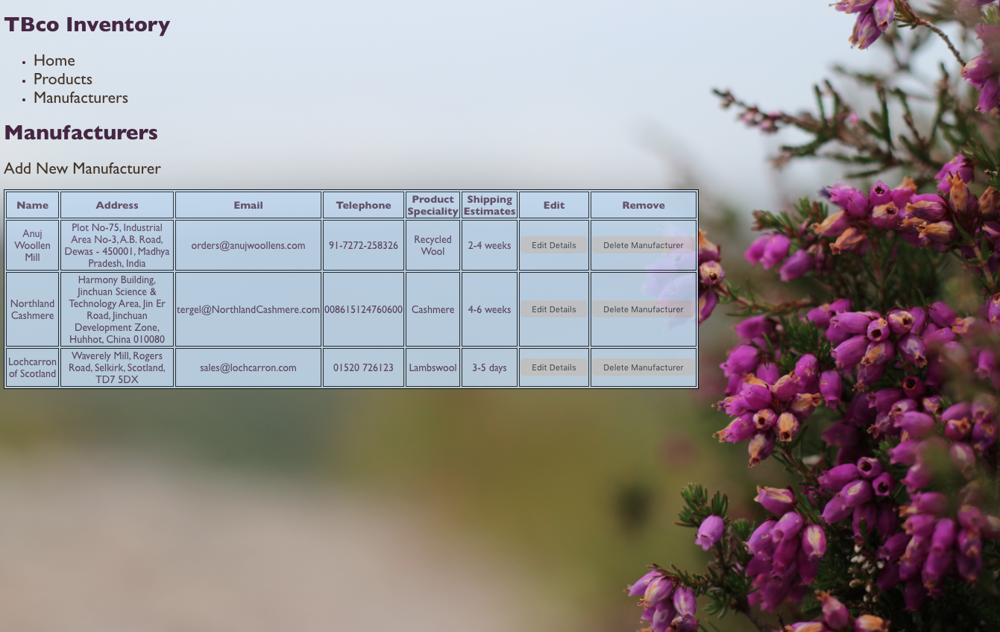

# E-Commerce Shop Inventory App

### **Brief**

Build an app which allows a shopkeeper to track their shop's inventory. This is not an app which the customer will see, it is an admin/management app for the shop workers.

 
 

### **The User**

Client is starting up an e-commerce company to sell tartan blankets. 
They are starting small and want to keep track of all their products from their manufacturers.

As a solo entreprenuer, they need to be able to:\
See all the items in their inventory at once\
Each product to have their name, description [wool type and size], stock levels [with visual indicators for high, low and OoS] and buying/selling costs\
Easily identify low level products and OoS products\
Know what products are from what manufacturer and be able to access their their details\
Add/remove products and manufacturers easily

 
 

### Planning Diagrams

# The App

### **Home**
A brief summary of stock so the client can prioritise ordering more stock.

 
 

### **Products**
An extensive look at all current products in stock with the option to add a new product, edit existing ones, as well as deleting products. Markup value is also listed here.

 
 

### **Manufacturers**
A page that lists all the necessary information for contacting current manufacturers/suppliers, with the ability to add new manufacturers, edit the details of existing ones and delete ones that may have gone bust.

 
 

### Running Instructions

Once files are cloned and opened, ensure the following:\
You have used the 'createdb' command to create the database in the sql_runner.rb file "tbcoinventory"\
Generate the tables by running 'psql -d tbcoinventory -f products.sql' - the file path will be dependent on where you are running the command from\
Populate your database by running 'ruby seeds.rb' to seed the db

Once this is complete, you can use the 'ruby master_controller.rb' command and connect to the local host, and be on your merry way! :+1:

### **Technologies Used**

Ruby
SQL
Sinatra

